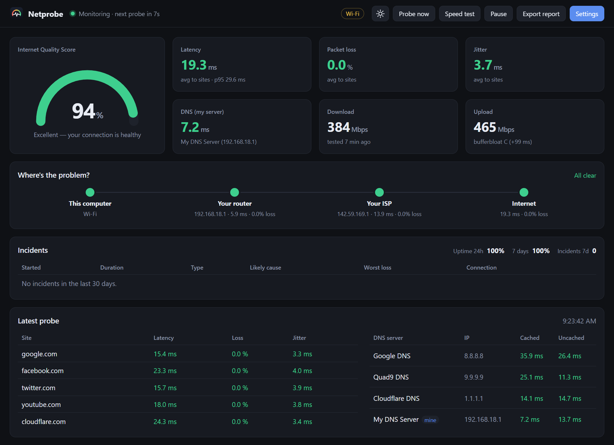
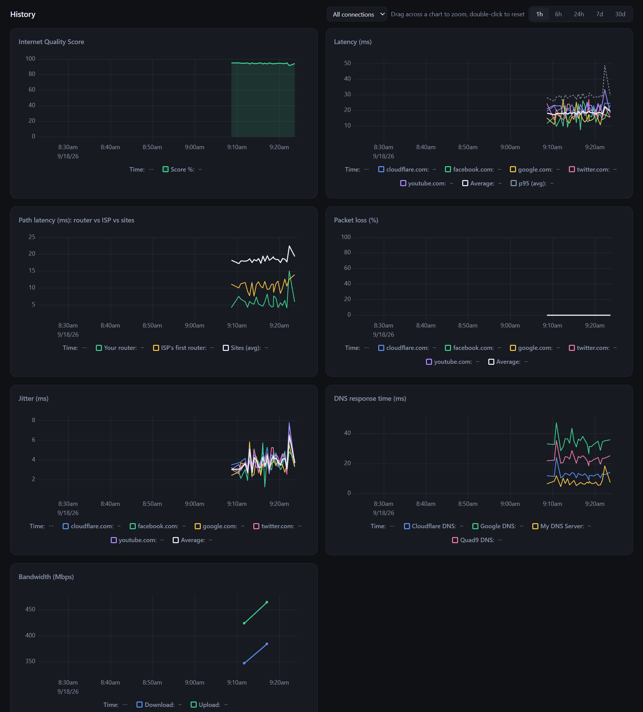

# Netprobe Desktop

[](https://github.com/UmaisNisar/netprobe_lite/actions/workflows/desktop-ci.yml)
[](https://github.com/UmaisNisar/netprobe_lite/releases/latest)

**Monitor your home internet quality from the system tray. No Docker, no Grafana, no config files.**

Netprobe checks your connection every 30 seconds for **latency, packet loss, jitter and DNS response time**, runs optional **bandwidth tests**, and rolls it all into a single **Internet Quality Score**. Download it, install it, and it starts recording. When your ISP says "everything looks fine on our end", you have 30 days of history to show them.

This is a desktop port of [plaintextpackets/netprobe_lite](https://github.com/plaintextpackets/netprobe_lite). The original runs as six Docker containers (Python probes, Redis, Prometheus and Grafana). This version does the same job in one app.





## Download

| Platform | File |
|---|---|
| **Windows** 10/11 (installer) | [Netprobe-Setup.exe](https://github.com/UmaisNisar/netprobe_lite/releases/latest/download/Netprobe-Setup.exe) |
| **Windows** (portable, no install) | [Netprobe-Portable.exe](https://github.com/UmaisNisar/netprobe_lite/releases/latest/download/Netprobe-Portable.exe) |
| **macOS**, Apple Silicon (M1–M4) | [Netprobe-mac-arm64.dmg](https://github.com/UmaisNisar/netprobe_lite/releases/latest/download/Netprobe-mac-arm64.dmg) |
| **macOS**, Intel | [Netprobe-mac-x64.dmg](https://github.com/UmaisNisar/netprobe_lite/releases/latest/download/Netprobe-mac-x64.dmg) |
| **Linux** (AppImage) | [Netprobe-linux.AppImage](https://github.com/UmaisNisar/netprobe_lite/releases/latest/download/Netprobe-linux.AppImage) |

All releases: [github.com/UmaisNisar/netprobe_lite/releases](https://github.com/UmaisNisar/netprobe_lite/releases)

### First launch: security warnings

The builds are not code-signed yet (signing certificates cost money; see [Code signing](#code-signing)), so your OS will warn you the first time you open the app:

- **Windows:** SmartScreen shows "Windows protected your PC". Click **More info → Run anyway**.
- **macOS:** You may see "Netprobe can't be opened" or "is damaged". Open **System Settings → Privacy & Security** and click **Open Anyway**, or run this once in Terminal:
  ```sh
  xattr -dr com.apple.quarantine /Applications/Netprobe.app
  ```
- **Linux:** make the file executable first: `chmod +x Netprobe-linux.AppImage`.

## Features

- **Tells you when your internet breaks.** Outages (2 probes in a row where no site answers) and slowdowns (3 bad probes in a row) become **incidents** with a start, end, duration and severity. You get a desktop notification when one starts and when it's over, a red strip on the dashboard while it lasts, and shaded bands on every chart.
- **Tells you where the problem is.** Each probe also pings **your router** and **your ISP's first router**, so Netprobe can say whether a problem is in your home network (Wi-Fi or router), at your ISP, or further out. A traceroute is saved with every incident.
- **Uptime.** Uptime for the last 24 hours and 7 days, counting only the time the computer was on.
- **A report you can send your ISP.** **Export report** creates a PDF with plain-language findings ("uptime 99.4%: 3 outages totalling 22 min; most located at your ISP"), charts, an incident list with likely causes, a day-by-day table and speed tests compared with your plan. It can also export the raw data as CSV.
- **Measures what matters.** It reports 95th-percentile latency, not just averages (spikes are what ruin calls), and full uncached DNS lookups as well as cached ones. Speed tests measure **latency under load (bufferbloat)** and grade it A+ to F.
- **Speed tests on your terms.** Enter your plan's speeds to see results as a % of what you pay for. Run tests every N minutes or at set times of day (e.g. peak vs off-peak), and cap how much data automatic tests may use each month.
- **Always on, if you want.** Share the dashboard with other devices on your network, run Netprobe headless on a home server or Raspberry Pi, and point Prometheus/Grafana at `/metrics`. The original Grafana dashboard works unchanged. See [Always-on mode](#always-on-mode).
- **Keeps itself up to date.** New versions install in the background on Windows and Linux (on restart). On macOS you get a notification with a download link.
- **Light and dark mode.** Switch with the sun/moon button in the top bar, or follow your system (Settings → Appearance).
- **Guided first run.** A short welcome screen shows your detected connection, router and DNS, and asks about speed tests, your plan, notifications and start-at-login.
- **Runs in the tray.** Closing the window keeps monitoring. The tray icon turns green, amber or red with your score, and hovering it shows the current numbers.
- **Can start at login** (off by default; turn it on in the welcome screen or Settings) so history builds up without you thinking about it.
- **Live dashboard:** a score gauge, current latency, loss, jitter, DNS and bandwidth, plus a per-site and per-DNS-server breakdown of the latest probe.
- **History charts** for 1h, 6h, 24h, 7d or 30d, with synced crosshairs across all charts. Gaps show when the PC was off rather than drawing misleading lines.
- **Settings in the app:** sites, DNS servers, probe interval, score weights, thresholds, speed test and retention. No `.env` editing.
- **Follows your network.** Your own DNS server and your router are detected from the network you're on and update automatically when you switch networks (home, office, phone hotspot).
- **Knows the conditions of every sample.** A chip in the top bar shows Wi-Fi, Wired or VPN (hover it for what that means). The connection type is recorded with every probe, and history can be filtered to wired-only or Wi-Fi-only.
- **No false outages.** Monitoring pauses while the computer sleeps. After waking up or switching networks, it waits for the connection to settle before judging anything.
- **Local only.** Data stays in a SQLite file on your machine. No accounts, no telemetry, no open ports.
- **No admin rights needed.** On Windows it calls the system's ICMP API directly (sub-millisecond timing); elsewhere it uses the built-in `ping`.

## What it measures

Every probe (default: every 30 s):

| Metric | How |
|---|---|
| **Latency** | Average, median and 95th/99th percentile round-trip time of 50 pings to each site (default: google.com, facebook.com, twitter.com, youtube.com, cloudflare.com) |
| **Packet loss** | Percentage of those pings that got no reply |
| **Jitter** | Mean difference between consecutive ping times (RFC 3550 style) |
| **DNS response time** | Time to resolve `google.com` against Google (8.8.8.8), Quad9 (9.9.9.9), Cloudflare (1.1.1.1) and **your own DNS server**. A failed lookup counts as 5000 ms. A second lookup of a random name (which no resolver can have cached) measures a full recursive lookup |
| **Path** | 20 pings each to your router and to your ISP's first router (found with a fast TTL scan), used to locate problems |
| **Bandwidth** *(optional, off by default)* | Download and upload throughput against `speed.cloudflare.com`, using 4 parallel streams for 8 seconds each way (capped at 500 MB per direction) |
| **Bufferbloat** *(with each speed test)* | Latency to 1.1.1.1 while idle and while the download and upload are running. The increase is graded A+ (<5 ms) / A (<30) / B (<60) / C (<200) / D (<400) / F, the same scale as Waveform's bufferbloat test |

### Incidents and "where's the problem"

| | When |
|---|---|
| **Outage** | 2 probes in a row where no site answers |
| **Slowdown** | 3 probes in a row with a score under 60% or at least 2% packet loss (both adjustable) |
| **Over** | 2 good probes in a row |

For each bad probe, Netprobe checks the path from the inside out:

1. **Your router** is slow, lossy or unreachable → *your home network (Wi-Fi or router)*
2. Otherwise, **your ISP's first router** is slow, lossy or unreachable → *your ISP*
3. Otherwise, if the ISP's router answered normally → *beyond your ISP's first router*
4. If the ISP's routers don't answer ping (common on mobile networks) → *your ISP or beyond*

A router that ignores ping while websites work is marked "doesn't answer ping", not blamed. On a VPN, the path is the VPN's.

### Internet Quality Score

It's the same formula as the original. Each metric is compared to its threshold (capped at 100%), and the weighted results are subtracted from 1:

```
score = 1 − 0.60 × min(loss / 5%, 1)
          − 0.15 × min(latency / 100 ms, 1)
          − 0.20 × min(jitter / 30 ms, 1)
          − 0.05 × min(my DNS / 100 ms, 1)
```

**100%** is perfect. Packet loss dominates because it's what actually breaks calls and games. Weights and thresholds can be changed in Settings.

## Getting accurate results

- **Use a wired connection if you can.** On Wi-Fi you're measuring your Wi-Fi *plus* your ISP. That's still useful, and the router check tells you when Wi-Fi is the culprit, but for the cleanest ISP data run it on a PC connected to your router by Ethernet. The top-bar chip shows which kind of connection your internet traffic is using.
- **Turn off your VPN.** With a VPN on, every measurement goes through the VPN server, so it says nothing about your ISP.
- **Leave it running.** Netprobe only records while the computer is on. For 24/7 coverage, use [always-on mode](#always-on-mode) on a machine that never sleeps.
- **Some sites ignore ping.** amazon.com and netflix.com, for example, block ICMP. A site that answers no pings while others do is marked **no reply** and left out of the score. If *every* site goes silent, that's an outage and counts as 100% loss.
- **Speed tests use data.** A test uses about 200 MB on a 100 Mbps line and at most ~1 GB on gigabit+. At the default ~15-minute interval that adds up, so leave it off on metered or mobile connections, use set times of day instead, or set a monthly data budget. If Cloudflare rate-limits the tests, Netprobe backs off automatically (30 min, doubling up to 4 h).

## Settings

Click **Settings** in the top-right corner of the dashboard.

| Setting | Default | Notes |
|---|---|---|
| Sites to ping | 5 popular sites | One domain per line, up to 20 |
| Probe interval | 30 s | 15 s to 1 h |
| Pings per site | 50 | Sent over 5 parallel streams, so a probe takes about 10 s |
| DNS test domain | google.com | |
| DNS servers | Google, Quad9, Cloudflare, *your network's DNS* | Mark the one your network uses as **mine**; it feeds the score. With **auto**, it follows whichever network you're on |
| Speed test | Off | Every N minutes (default ~15) or at set times of day |
| Your plan | not set | Download/upload Mbps; results are shown as a % of the plan |
| Monthly data budget | no limit | Automatic tests stop once they've used this many GB in the month |
| Score weights / thresholds | 0.6 / 0.15 / 0.2 / 0.05 and 5% / 100 / 30 / 100 ms | Weights should add up to 1.0 |
| Start at login | Off | Starts hidden in the tray |
| Notifications | Off | Desktop notification when an incident starts and ends |
| Slowdown thresholds | score < 60% or loss ≥ 2% | What counts as a bad probe |
| Keep history for | 30 days | Older data is deleted automatically |
| Web dashboard & metrics | Off | Serves the dashboard and `/metrics` on port 7979; optionally to other devices, with an optional access token |
| Keep up to date | On | Checks GitHub Releases every 6 hours |
| Theme | Match my system | Or Light / Dark; the top-bar button switches instantly |

The tray menu also has **Probe now**, **Run speed test now**, **Pause monitoring**, **Restart to update** (when an update is ready) and **Quit**.

## Always-on mode

A laptop that sleeps can't tell you about the outage at 3 a.m. Netprobe can also run 24/7 and serve its dashboard over HTTP.

**From the desktop app:** Settings → *Web dashboard & metrics* → turn it on. Tick *Allow other devices on my network* to open it from your phone (`http://<this-computer>:7979/`).

**Headless, on a home server, NAS or Raspberry Pi** (needs [Node.js](https://nodejs.org/) 22.13+, no Electron):

```sh
git clone https://github.com/UmaisNisar/netprobe_lite.git
cd netprobe_lite/desktop && npm ci --omit=dev
node src/cli.js --host 0.0.0.0 --port 7979            # add --token <secret> to require a token
```

**With the packaged app, no window:** `Netprobe --headless` (Windows: `"%LOCALAPPDATA%\Programs\Netprobe\Netprobe.exe" --headless`). It uses the web dashboard settings.

Run it as a service so it starts on boot:

<details>
<summary>Linux (systemd)</summary>

```ini
# /etc/systemd/system/netprobe.service
[Unit]
Description=Netprobe
After=network-online.target
Wants=network-online.target

[Service]
ExecStart=/usr/bin/node /opt/netprobe_lite/desktop/src/cli.js --host 0.0.0.0 --port 7979
Environment=NETPROBE_DATA=/var/lib/netprobe
Restart=always
User=netprobe

[Install]
WantedBy=multi-user.target
```
Then run `sudo systemctl enable --now netprobe`.
</details>

<details>
<summary>Windows (Task Scheduler)</summary>

Create a task that runs at startup, whether or not a user is logged on, with the action
`"C:\Users\<you>\AppData\Local\Programs\Netprobe\Netprobe.exe" --headless`. Turn on the web dashboard in Settings first, so you can reach it.
</details>

<details>
<summary>macOS (launchd)</summary>

Save as `~/Library/LaunchAgents/com.netprobe.headless.plist` and run `launchctl load` on it:

```xml
<?xml version="1.0" encoding="UTF-8"?>
<!DOCTYPE plist PUBLIC "-//Apple//DTD PLIST 1.0//EN" "http://www.apple.com/DTDs/PropertyList-1.0.dtd">
<plist version="1.0"><dict>
  <key>Label</key><string>com.netprobe.headless</string>
  <key>ProgramArguments</key><array>
    <string>/Applications/Netprobe.app/Contents/MacOS/Netprobe</string><string>--headless</string>
  </array>
  <key>RunAtLoad</key><true/><key>KeepAlive</key><true/>
</dict></plist>
```
</details>

**Access:** without a token, other devices can *view* the dashboard, but only the machine running Netprobe can change settings, pause or clear history. With a token (`--token`, or Settings → *Access token*), every other device needs it. Open `http://host:7979/?token=<token>` once in each browser, or send it as `Authorization: Bearer <token>`. In a browser, **Export report** opens the report and your browser's *Save as PDF*.

**Prometheus / Grafana:** scrape `http://host:7979/metrics`. The `Network_Stats`, `DNS_Stats`, `Speed_Stats` and `Health_Stats` metrics use the same names and labels as the original exporter, so [the original Grafana dashboard](config/grafana/dashboards/netprobe.json) works as is. New `netprobe_*` metrics add router/ISP-hop latency and loss, p95 latency, uncached DNS, uptime, open incidents, connection type and bufferbloat.

Only one Netprobe (desktop or headless) can use a given data folder at a time.

### Where data is stored

| OS | Folder |
|---|---|
| Windows | `%APPDATA%\Netprobe` |
| macOS | `~/Library/Application Support/Netprobe` |
| Linux | `~/.config/Netprobe` |

It contains `settings.json` and `netprobe.db` (SQLite). Delete the folder to reset everything, or use **Settings → Clear all history**.

## How it differs from the Docker version

| | netprobe_lite (Docker) | Netprobe Desktop |
|---|---|---|
| Install | Docker + `docker compose up` | Download and run an installer |
| Components | 6 containers: Python probe, speed test, Redis, exporter, Prometheus, Grafana | 1 app (Electron) |
| Dashboard | Grafana at `http://<ip>:3001`, login `admin/admin` | Built-in window + tray icon; optional web dashboard; `/metrics` compatible with the original Grafana dashboard |
| Configuration | Edit `.env` and restart | Settings screen, applied immediately |
| Storage | Prometheus TSDB in a Docker volume | SQLite file in your user folder |
| Speed test | speedtest.net (`speedtest-cli`) | speed.cloudflare.com |
| Jitter | `ping`'s `mdev` (standard deviation) | Mean consecutive difference (true jitter) |
| Home DNS | Must be named `My_DNS_Server`, or the score crashes | Any server can be marked "mine"; auto-detected |
| Sites that block ping | Silently dropped | Shown as "no reply", left out of the score |
| Outages and alerts | None (charts only) | Incidents, notifications, uptime, traceroutes |
| Reports | Grafana screenshots | PDF report with findings, CSV export |
| Latency detail | Averages | Percentiles, bufferbloat, uncached DNS |
| Locating problems | No | Router vs ISP vs beyond |
| Runs when | Always, on a server | While your computer is on, or 24/7 in always-on mode |
| Platforms | Linux (anywhere Docker runs) | Windows, macOS, Linux |

The original Python/Docker code is still in this repo, unchanged. Its instructions are in [docs/DOCKER.md](docs/DOCKER.md).

## Build from source

Requires [Node.js](https://nodejs.org/) 22 or newer.

```sh
git clone https://github.com/UmaisNisar/netprobe_lite.git
cd netprobe_lite/desktop
npm install
npm start            # run in development
npm test             # unit tests
npm run check        # lint + unit tests with coverage thresholds
npm run smoke        # boot the real app, run one probe end to end, exit
npm run test:e2e     # UI tests: the real app driven with Playwright (fake network)
npm run dist:win     # -> dist/Netprobe-Setup.exe + Netprobe-Portable.exe
npm run dist:mac     # -> dist/Netprobe-mac-arm64.dmg + Netprobe-mac-x64.dmg (must run on macOS)
npm run dist:linux   # -> dist/Netprobe-linux.AppImage
```

> Running from a VS Code terminal? VS Code sets `ELECTRON_RUN_AS_NODE=1`, which stops Electron from starting as an app. Unset it first: `set ELECTRON_RUN_AS_NODE=` (cmd), `Remove-Item Env:ELECTRON_RUN_AS_NODE` (PowerShell) or `unset ELECTRON_RUN_AS_NODE` (bash).

### Tests

| Suite | What it covers |
|---|---|
| `test/probe.test.js` | Ping output parsing (Windows, localized Windows, macOS, Linux), per-OS `ping` arguments, native/binary backends, percentiles, jitter, latency sampling, cached and uncached DNS against a local fake DNS server (success, NXDOMAIN, SERVFAIL, timeout, bad address) |
| `test/icmp.test.js` | Windows ICMP via koffi (with a fake koffi on every OS, plus the real API on Windows): byte order, reply parsing, losses, warm-up, fallback when unavailable |
| `test/report.test.js` | Report maths (uptime, clipping, plan %, bufferbloat), plain-language findings, daily breakdown, downsampling, CSV escaping and columns |
| `test/speedtest.test.js` | Throughput math, 500 MB cap, request count, data used, latency under load per direction, HTTP 429/403/500 and network failures (fake `fetch`) |
| `test/score.test.js` | Quality score formula, thresholds, non-replying sites, outages, home-DNS selection |
| `test/db.test.js` | SQLite writes, upgrading 1.0 databases, time-window queries, connection filter, bucket averaging, incidents, uptime, retention, atomic saves |
| `test/network.test.js` | Interface, router and DNS detection per OS (including VPNs), TTL hop discovery, finding the ISP's router |
| `test/diagnose.test.js` | Outage/slowdown judgement and locating the problem (home, ISP, beyond, VPN, silent routers) |
| `test/incidents.test.js` | Incident state machine: open/escalate/close thresholds, blame, sleep/network-change interruptions |
| `test/trace.test.js` | Traceroute per OS, partial output, missing tools |
| `test/settings.test.js` | Defaults, first-run DNS detection, validation and clamping, corrupt files, persistence |
| `test/renderer-lib.test.js` | Dashboard formatting, colour levels, chart data pivoting and gap handling, HTML escaping |
| `test/monitor.test.js` | The engine with a fake clock and network: scheduling, detection timeout, auto DNS, incidents with traceroute, network changes, sleep/wake and silent sleeps, pause, speed-test interval/times/back-off/budget, settings changes, crash recovery |
| `test/e2e/ui.test.js` | The real app driven with Playwright: first-run welcome, live results and accessibility labels, settings saved and reloaded, DNS "auto" rules, history range and filter, charts spanning the selected range, export dialog, speed test with plan % and bufferbloat, light/dark toggle, a full outage scenario |
| `test/metrics.test.js` | Prometheus output: original metric names/labels (Grafana compatibility), new metrics, missing values, escaping |
| `test/server.test.js` | Web server: pages and assets, JSON API, CSV/report, SSE, actions, bad input, read-only viewers, token auth and cookies |
| `test/service.test.js` | Data-folder lock (stale locks, other processes), headless CLI start/stop, updater version logic and both update modes |
| `scripts/smoke.js` | Launches the real Electron app and checks a first-run profile shows the welcome screen, the dashboard loads without errors, a full probe is stored and rendered, the web dashboard and `/metrics` are served over HTTP, and a PDF report renders |

Coverage minimums (90% lines, 90% functions, 80% branches) are enforced by `npm run check`. The Electron-only files (`main.js`, `preload.js`, `app.js`) are covered by the smoke and UI tests instead.

### CI/CD

- **[Desktop CI](.github/workflows/desktop-ci.yml)** runs on every push and pull request that touches `desktop/`:
  - lint plus unit tests with coverage on Node 22 and 24
  - unit tests, the Electron smoke test, the UI end-to-end tests and an unsigned packaging check on Windows, macOS and Linux
  - installers uploaded as build artifacts for 7 days
- **[Desktop release](.github/workflows/desktop-release.yml)** runs when a `desktop-v<semver>` tag is pushed:
  - checks the tag format
  - runs the full CI
  - builds all installers with the version taken from the tag
  - publishes a GitHub Release with `SHA256SUMS.txt`
  - tags with a suffix (for example `desktop-v1.1.0-beta.1`) are published as pre-releases
- **Dependabot** checks npm and GitHub Actions dependencies weekly.

To release:

```sh
git tag desktop-v1.3.0 && git push origin desktop-v1.3.0
```

The Docker version keeps upstream's `v*` tags; desktop releases use `desktop-v*` so the two never collide. Each release includes `latest*.yml` and `.blockmap` files, which installed copies use to update themselves.

### Code signing

Builds are unsigned until certificates are added. The release workflow already passes these repository secrets to electron-builder, so adding them is all it takes:

| Secret | For |
|---|---|
| `CSC_LINK`, `CSC_KEY_PASSWORD` | Base64 of a `.pfx` (Windows) or `.p12` (macOS Developer ID) certificate, and its password |
| `APPLE_ID`, `APPLE_APP_SPECIFIC_PASSWORD`, `APPLE_TEAM_ID` | macOS notarization (also add `"notarize": true` under `build.mac` in `package.json`) |

Options: an [Apple Developer account](https://developer.apple.com/programs/) ($99/year) removes the macOS warning and allows in-place updates there; [Azure Trusted Signing](https://learn.microsoft.com/azure/trusted-signing/) (~$10/month) or an OV certificate removes Windows SmartScreen warnings.

### Project layout

```
desktop/
├── src/
│   ├── main/
│   │   ├── main.js        # Electron shell: window, tray, notifications, power events, IPC, --headless
│   │   ├── server.js      # web dashboard, JSON API, SSE, CSV/report, /metrics (plain Node)
│   │   ├── metrics.js     # Prometheus exposition (original names + netprobe_*)
│   │   ├── updater.js     # auto-update from GitHub Releases
│   │   ├── lock.js        # one monitor per data folder
│   │   ├── monitor.js     # engine: scheduling, state, incidents, sleep/network handling
│   │   ├── probe.js       # ping (loss/latency/jitter/percentiles), router/ISP pings, DNS timing
│   │   ├── icmp.js        # native Windows ICMP (IcmpSendEcho via koffi), ping.exe fallback
│   │   ├── network.js     # interface/router/DNS detection, TTL hop discovery
│   │   ├── diagnose.js    # ok/slowdown/outage + where the problem is
│   │   ├── incidents.js   # incident state machine
│   │   ├── trace.js       # traceroute captured on incidents
│   │   ├── speedtest.js   # Cloudflare bandwidth test + latency under load
│   │   ├── report.js      # report data, findings, CSV export
│   │   ├── score.js       # Internet Quality Score
│   │   ├── db.js          # SQLite history (node:sqlite), downsampling, retention
│   │   └── settings.js    # settings.json, defaults, validation, DNS auto-detect
│   ├── cli.js             # headless mode (Node only)
│   ├── preload.js         # safe IPC bridge to the dashboard
│   └── renderer/          # dashboard (index.html, app.js), report page, shared lib.js, web-bridge.js for browsers
├── assets/                # app and tray icons (generated by `npm run icons`)
├── scripts/               # smoke test, icon generator, screenshot helper
└── test/                  # node:test unit tests
```

There's no bundler. Storage uses the SQLite built into Electron's Node runtime. Runtime dependencies are [uPlot](https://github.com/leeoniya/uPlot) for charts, [electron-updater](https://www.electron.build/auto-update) for updates, and [koffi](https://koffi.dev) for the Windows ICMP call (only the Windows builds of koffi are packaged; if it can't load, Netprobe falls back to `ping.exe`).

## Credits and license

The original Netprobe design, metrics and Internet Quality Score come from **[plaintextpackets](https://github.com/plaintextpackets)** ([netprobe_lite](https://github.com/plaintextpackets/netprobe_lite), [video tutorial](https://youtu.be/Wn31husi6tc)). To support their work: [buymeacoffee.com/plaintextpm](https://buymeacoffee.com/plaintextpm).

The desktop port is by [Umais Nisar](https://github.com/UmaisNisar).

This project inherits the original's license terms:

> This project is released under a custom license that restricts commercial use. You are free to use, modify, and distribute the software for non-commercial purposes. Commercial use of this software is strictly prohibited without prior permission. If you have any questions or wish to use this software commercially, please contact [plaintextpackets@gmail.com].
